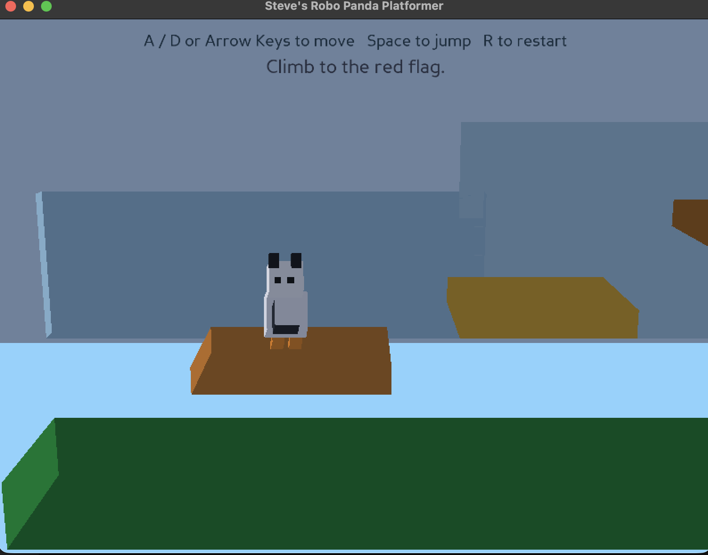
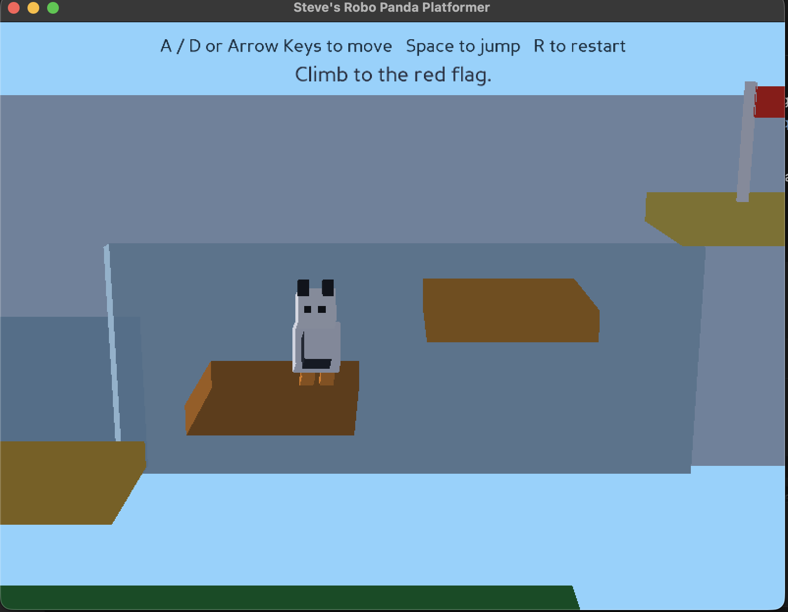

# steves-robo-panda3d

Steves Robo Panda Platformer game built with Panda3D python library is a platformer with a small robo-panda hero, jumping, basic
platform collision, a goal flag, and restart support.

## Run
Run the main.py file. On macOS/linux use the command below:
```bash
python3 main.py
```

## Controls

- `A` / `D` or left/right arrows to move
- `Space`, `W`, or up arrow to jump
- `R` to restart after a fall or a win

## Install Panda3D

```bash
python3 -m pip install -r requirements.txt
```

## Screenshots




